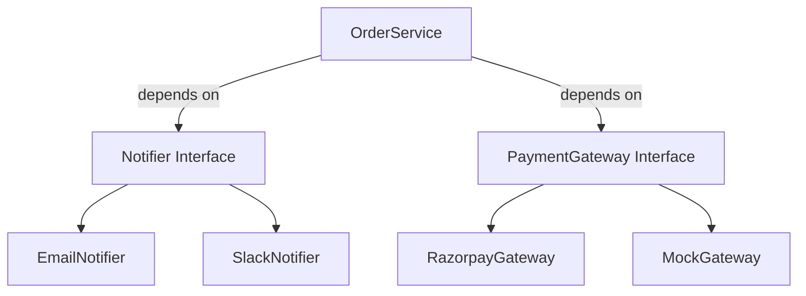

Great, Eshwar! Let’s now complete the **fifth and final SOLID principle** — the **Dependency Inversion Principle (DIP)** — which is **the backbone of scalable, decoupled, plug-and-play architecture** seen in enterprise supply chain systems like **Target’s OMS, WMS, and Payments platforms**.

---

# ✅ Dependency Inversion Principle (DIP) – Full Guide with Cheat Sheet + LLD Example

---

## 💡 What is Dependency Inversion Principle?

> **"High-level modules should not depend on low-level modules. Both should depend on abstractions."**

Also:

> **"Abstractions should not depend on details. Details should depend on abstractions."**

---

### 🔄 In simple terms:

* Don’t hardcode concrete classes inside business logic.
* Instead, depend on **interfaces** or **abstract classes**.
* Let actual implementations be **injected (via constructor or setter)**.

---

## ❗Why It Matters in Supply Chain Systems

In a dynamic supply chain, we often switch:

* Notification providers (Email, SMS, Slack)
* Inventory systems (In-House, Vendor APIs)
* Payment gateways (Razorpay, Stripe, PayU)
* Shipping carriers (FedEx, Delhivery, DTDC)

🧱 Without DIP, switching a dependency → **code changes everywhere**
⚡ With DIP → you just **plug new implementations** via interfaces

---

## 🚫 Anti-Pattern: Violation of DIP

```java
public class OrderService {
    private EmailService emailService = new EmailService(); // tightly coupled

    public void placeOrder(Order order) {
        // business logic
        emailService.sendEmail(order); // hard dependency
    }
}
```

### ❌ Problems:

* Cannot change to Slack/SMS
* Cannot unit test `OrderService` without real `EmailService`
* No flexibility, tightly coupled, breaks OCP

---

## ✅ DIP-Compliant Version – Interface Inversion

### Step 1: Define abstraction

```java
public interface Notifier {
    void notify(Order order);
}
```

### Step 2: Implement concrete classes

```java
public class EmailNotifier implements Notifier {
    public void notify(Order order) {
        // send email
    }
}

public class SlackNotifier implements Notifier {
    public void notify(Order order) {
        // send Slack message
    }
}
```

### Step 3: Inject via constructor (Inversion of Control)

```java
public class OrderService {
    private final Notifier notifier;

    public OrderService(Notifier notifier) {
        this.notifier = notifier;
    }

    public void placeOrder(Order order) {
        // business logic
        notifier.notify(order); // uses abstraction
    }
}
```

Now:
✅ You can pass any notifier
✅ Easy to unit test with `MockNotifier`
✅ Supports runtime swapping via Spring DI or manual wiring

---

## 🧠 Core Concepts in DIP

| Concept              | Meaning                                                         |
| -------------------- | --------------------------------------------------------------- |
| High-level module    | Business logic layer (e.g., `OrderService`)                     |
| Low-level module     | Implementation layer (e.g., `EmailNotifier`, `RazorpayPayment`) |
| Abstraction          | Interface (e.g., `Notifier`, `PaymentGateway`)                  |
| Dependency Inversion | High-level and low-level code both rely on interface            |

---

## 🔌 Real-World Supply Chain Use Cases

| Service       | Interface          | Implementations                        |
| ------------- | ------------------ | -------------------------------------- |
| Notifications | `Notifier`         | Email, SMS, Slack, Push                |
| Shipping      | `ShippingProvider` | FedEx, DTDC, Delhivery                 |
| Payments      | `PaymentGateway`   | Stripe, Razorpay, PayU                 |
| Inventory     | `InventorySource`  | InternalDB, VendorAPI                  |
| Logging       | `Logger`           | FileLogger, KafkaLogger, ElasticLogger |

---

## 🧩 LLD Problem – DIP for Payment Gateway System

### ❓ Problem:

You want to support multiple payment gateways:

* Razorpay
* Stripe
* MockGateway (for tests)

You have `PaymentService` which processes payments.

---

### ❌ DIP Violation

```java
public class PaymentService {
    private final RazorpayGateway gateway = new RazorpayGateway(); // tight coupling

    public void pay(Order order) {
        gateway.pay(order); // hard dependency
    }
}
```

---

### ✅ DIP-Compliant Design

```java
// Abstraction
public interface PaymentGateway {
    void pay(Order order);
}

// Concrete
public class RazorpayGateway implements PaymentGateway {
    public void pay(Order order) {
        // real payment logic
    }
}

public class MockPaymentGateway implements PaymentGateway {
    public void pay(Order order) {
        // no-op for testing
    }
}

// Service depends on abstraction
public class PaymentService {
    private final PaymentGateway gateway;

    public PaymentService(PaymentGateway gateway) {
        this.gateway = gateway;
    }

    public void pay(Order order) {
        gateway.pay(order);
    }
}
```

✅ Now you can inject Razorpay, Stripe, or Mock at runtime
✅ Test-friendly, modular, and enterprise-ready

---

## 🧪 How to Identify DIP Violations

| Symptom                                               | Violation       |
| ----------------------------------------------------- | --------------- |
| `new` keyword used inside a business class            | Tightly coupled |
| Cannot test service without real dependencies         | No abstraction  |
| Swapping low-level module requires code change        | No DIP          |
| High-level logic knows too much about implementations | Tight coupling  |

---

## 🧾 DIP – Interview Cheat Sheet

| Area               | Summary                                                                              |
| ------------------ | ------------------------------------------------------------------------------------ |
| 📖 Definition      | High-level modules should not depend on low-level ones. Both depend on abstractions. |
| 🎯 Goal            | Decouple layers via interfaces                                                       |
| 💥 Violation       | High-level classes use `new` to create dependencies                                  |
| 🔧 Fix             | Use interfaces, inject dependencies (constructor/setter)                             |
| 🧩 Patterns        | Strategy, Factory, Adapter, Dependency Injection                                     |
| 🛒 In Supply Chain | Notifications, shipping, payments, taxes                                             |
| 🧪 Recognition     | Hardcoded dependencies, poor testability                                             |

---

## 💬 Common Interview Questions

| Question                                 | Sample Answer                                                                |
| ---------------------------------------- | ---------------------------------------------------------------------------- |
| What is DIP?                             | DIP says classes should depend on abstractions, not concrete implementations |
| Why is it important?                     | It allows flexibility, better testing, and extension of systems              |
| How do you apply DIP?                    | Create interfaces, inject implementations via DI frameworks                  |
| What if I don't use Spring?              | Use manual constructor/setter injection                                      |
| When did you apply DIP in real projects? | Payment module, Notification system, Inventory access layer                  |

---

## 🧠 Summary: DIP in High-Traffic Systems

| Concept        | Dependency Inversion Principle                      |
| -------------- | --------------------------------------------------- |
| Used In        | All modular & plug-and-play architecture            |
| Benefit        | Flexibility, testability, scalability               |
| Best With      | Spring DI, Factory Pattern, Strategy Pattern        |
| Pattern Impact | Reduces code churn, avoids tight coupling           |
| Common in      | Microservices, Clean Architecture, Hexagonal Design |

---

## 🔁 Final Consolidated Example: Order Placement Flow



✅ All dependencies are **pluggable, mockable, and extensible**

---

## ✅ What’s Next?

Would you like:

1. 🔁 A **summary map** connecting all 5 SOLID principles?
2. 🧪 A **mock LLD problem** applying **all 5 SOLID principles** in one flow (e.g., *Design Modular Order Processing System*)?
3. 📥 Printable **SOLID + Patterns Quick Revision Sheet**?

Let me know how you’d like to revise or go forward!
